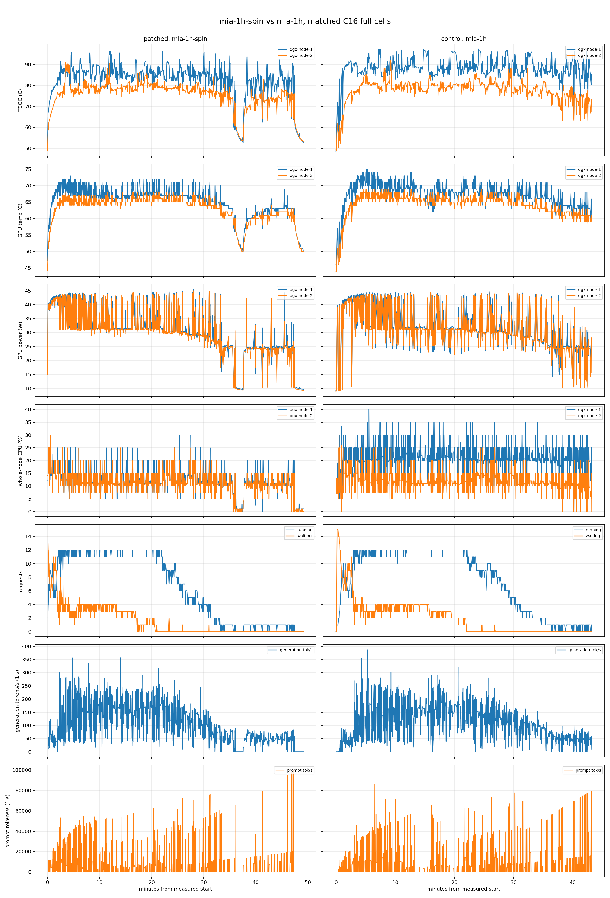

# Matched C16 full A/B: bounded `SpinCondition` sleep on GB10

**Date:** 2026-08-19

**Status:** first matched pair complete; mechanism and thermal claims supported; population-level performance claim not yet supported.

> **Public bundle note:** this directory publishes the reviewed report and its
> comparison plot. Native telemetry slices and full container logs remain in
> the internal experiment archive pending a separate redaction review; their
> SHA-256 values are retained below so a disclosed artifact can be matched to
> the exact evidence used for this report.

## Decision

The 250 microsecond bounded sleep removes the observed busy-wait almost
completely. In the steady process-level sample, head-only excess CPU fell from
**1.924 cores to 0.025 cores**: a reduction of **1.899 cores (98.7%)**. The
independent whole-node counter agrees, showing 1.803 fewer average CPU cores on
the head over the complete patched cell.

The thermal consequence is also visible. During active seconds where the two
nodes' GPU power differed by no more than 1 W, the mean head-minus-worker TSOC
gap fell from **10.27 C to 7.42 C**, a reduction of **2.85 C (27.8%)**. Head
TSOC p95 fell **5.20 C**, and time at or above 95 C fell from **214 s (8.25%)**
to **30 s (1.02%)**, even though the patched cell ran 357 s longer and produced
7.1% more output tokens. No GPU clock slowdown, thermal event, preemption,
request error, or engine restart was observed in either cell.

This pair does **not** establish a throughput speedup or regression. The
patched arm generated 7.1% more tokens and ran at 11.8% lower mean active
concurrency. Consequently, aggregate generation rate was 5.9% lower while the
concurrency-normalized rate was 9.8% higher and mean latency metrics were
better. Those directions are useful diagnostics, not interchangeable
performance claims. A crossover or fixed-request replay is required before a
performance number is published.

The evidence is sufficient to open an upstream engineering PR about eliminating
the spin cost on unified-memory SoCs, provided the PR describes performance as
"no failure or demonstrated latency regression in this matched diagnostic
pair" rather than claiming a proven speedup.

## Intervention and invariants

| item | patched arm | control arm |
|---|---|---|
| restricted-manager profile | `mia-1h-spin` | `mia-1h` |
| change under test | read-only overlay of `shm_broadcast.py` | stock image module |
| sleep | `time.sleep(0.00025)` after `sched_yield()` in the existing busy branch | none |
| image | `ghcr.io/anemll/dspark-vllm-gx10:0.1.1@sha256:a83948492cf13df455170fb42885f5ef4db54fefe0feff0f841ecbff464ac9d8` | same |
| model revision | `7872f01b1d1fe23eabc4c98b48bffcef5a386062` | same |
| topology | TP=2, gx10-01 head + gx10-02 worker, dual RoCE | same |
| workload | C16 full: nine task files rotated across 16 slots | same |
| runner SHA-256 | `1215471e924483bd647a4a6339467cb9c96bd87df50b18958c573df4d5dc25ef` | same |

The nine task filenames and SHA-256 values in both
`measurement-boundary.json` files are byte-for-byte identical. The captured
profile diff shows only profile/container labels plus the one read-only source
overlay. The tested patch SHA-256 is
`92a444be01dc4e78d6c996938cf3cf000530f0727960c7456573c99245be0b94`.
The patched runtime logs contain the explicit `SPINPATCH v1 active:
spin_sleep=0.00025s` marker on both nodes.

The local patch comment written before this experiment says the spin is "the
entire measured temperature gap." The data do not support that sentence. The
patch removes the CPU asymmetry and materially reduces the gap, but a residual
7.42 C mean gap remains in the matched-power subset. That comment must be
removed or corrected before turning the experiment into an upstream diff.

## Registered boundaries and sampling

| arm | measured UTC boundary | wall | result |
|---|---:|---:|---|
| patched | `2026-08-18T17:50:08.4274305Z` to `18:39:19.7224828Z` | 2951.295 s | 16/16 top-level tasks OK |
| control | `2026-08-18T18:48:56.2073995Z` to `19:32:10.7486170Z` | 2594.541 s | 16/16 top-level tasks OK |

The fixed order was patched then control. It was preregistered but not
randomized. The direction of that bias is known and runs against the reported
result: the patched arm started **1.72 C warmer** (50.42 C against 48.70 C, see
the distribution table) and still finished 5.81 C lower on mean head TSOC. Both cells used `-Slots 16 -Repeat 1 -Bypass -NoGuard`; telemetry
was observational and did not stop either service. Before each boundary, the
endpoint was idle for three consecutive samples and both nodes' GPU and TSOC
readings were at or below 55 C for three consecutive samples.

The existing `inference/temp-log.py` recorder supplied double-node thermal,
GPU power, memory and cumulative whole-node CPU counters, plus server counters.
It was configured as `--sweep 55 --every 5` and switches to a 1 s cadence
during/after detected prefill bursts. The native slices retained here have a
1 s median cadence, no error rows, and maximum gaps of 11 s (patched) and 12 s
(control). Analysis resamples to one second, interpolates time gaps up to 10 s,
and permits a five-second short forward fill. The raw native rows are retained
so that policy can be changed and the analysis repeated.

`run-mixed.ps1` also retained the exact measurement boundary, complete
Prometheus snapshots, one-second metrics timeline, client-load timeline,
runner logs, and summary. Two separate 120 s `pidstat` windows were added per
arm: one during ramp and one after the workload reached a steady portion. GPU
SM clock and slowdown state were sampled separately because the existing
thermal recorder does not expose SM clock.

Warm-ups were excluded from both boundaries. The patched arm received the
canonical `Return exactly the word READY.` warm-up once. The control arm
mistakenly received one non-canonical READY prompt before the canonical prompt.
Both completed before the three-sample idle/cool start gate, neither overlaps a
task prefix, and neither contributes to any boundary-delta metric. This is a
protocol deviation and is disclosed rather than silently normalized away.

## Direct CPU result

The preregistered head-only excess endpoint is:

```text
node-1 EngineCore CPU
+ (node-1 Worker_TP CPU - node-2 Worker_TP CPU)
```

`pidstat` reports 100% as one logical CPU. The subtraction removes the TP work
shared by the two nodes and isolates work structurally present only on the
head/local-reader side.

| phase | arm | EngineCore n1 | Worker_TP n1 | Worker_TP n2 | head-only excess |
|---|---:|---:|---:|---:|---:|
| ramp | patched | 2.02% | 258.40% | 258.24% | **2.18% = 0.0218 cores** |
| ramp | control | 93.55% | 246.56% | 246.97% | **93.14% = 0.9314 cores** |
| steady | patched | 2.06% | 214.03% | 213.57% | **2.52% = 0.0252 cores** |
| steady | control | 100.10% | 297.97% | 205.67% | **192.40% = 1.9240 cores** |

The ramp sample catches EngineCore spin but not the later local-vs-remote
Worker_TP asymmetry; using it alone would understate the bug. The steady result
is the decisive process-level observation: **1.8988 cores removed, 98.69% of
the control excess**.

Whole-node cumulative `/proc/stat` counters independently give:

| complete-cell mean | patched | control | patched - control |
|---|---:|---:|---:|
| gx10-01 CPU busy | 11.98% of 20 cores | 20.99% of 20 cores | **-9.01 pp = -1.803 cores** |
| gx10-02 CPU busy | 11.35% of 20 cores | 12.22% of 20 cores | -0.86 pp = -0.172 cores |
| head-minus-worker | 0.62 pp | 8.78 pp | **-8.15 pp** |

Deltas in this table are computed on unrounded values, so they do not reproduce
exactly from the rounded figures shown.

The process-level and whole-cell measurements use different windows and
aggregation, yet converge on roughly 1.8-1.9 eliminated cores.

## Thermal result

### Head-node distribution

| gx10-01 sensor | arm | start | mean | p50 | p90 | p95 | p99 | max |
|---|---:|---:|---:|---:|---:|---:|---:|---:|
| TSOC | patched | 50.42 | 82.26 | 84.30 | 89.10 | 90.74 | 94.95 | 96.30 |
| TSOC | control | 48.70 | 88.07 | 87.80 | 94.24 | 95.94 | 96.75 | 97.30 |
| GPU | patched | 47.20 | 65.04 | 66.40 | 70.00 | 71.00 | 71.65 | 73.00 |
| GPU | control | 46.00 | 67.18 | 68.00 | 71.00 | 72.00 | 74.00 | 75.00 |

All values are degrees Celsius. Head TSOC mean changed by **-5.81 C** and p95
by **-5.20 C**. Max changed by only -1.0 C because a maximum is a single
sample; dwell and upper quantiles better describe sustained exposure.

| gx10-01 TSOC dwell | patched | control |
|---|---:|---:|
| >=85 C | 1225 s / 2949 s = **41.54%** | 2227 s / 2594 s = **85.85%** |
| >=90 C | 205 s / 2949 s = **6.95%** | 742 s / 2594 s = **28.60%** |
| >=95 C | 30 s / 2949 s = **1.02%** | 214 s / 2594 s = **8.25%** |
| degree-seconds above 55 C | 80,471 | 85,799 |

### Every available head-node thermal zone

| zone | patched mean / p95 / max | control mean / p95 / max | p95 delta |
|---|---:|---:|---:|
| tz0 / TSOC | 82.26 / 90.74 / 96.30 | 88.07 / 95.94 / 97.30 | **-5.20** |
| tz1 | 64.30 / 67.99 / 69.40 | 67.65 / 70.80 / 72.10 | -2.81 |
| tz2 | 75.39 / 89.44 / 94.60 | 84.98 / 92.14 / 96.40 | -2.70 |
| tz3 | 64.83 / 67.90 / 69.30 | 67.70 / 70.40 / 71.90 | -2.50 |
| tz4 | 78.75 / 87.99 / 96.30 | 85.38 / 95.37 / 97.30 | **-7.39** |
| tz5 | 69.68 / 76.70 / 78.80 | 72.01 / 78.20 / 81.40 | -1.50 |
| tz6 | 69.57 / 78.10 / 79.70 | 74.50 / 80.70 / 82.70 | -2.60 |

The worker node remained much cooler in both arms: mean/p95/max TSOC was
75.55/82.00/91.00 C patched and 77.81/83.50/91.90 C control.

### Difference-in-differences at matched GPU power

Only active one-second samples with `abs(node1 GPU W - node2 GPU W) <= 1 W`
are included here.

| matched subset | patched | control | delta |
|---|---:|---:|---:|
| seconds retained | 1874 | 1473 | - |
| mean head-worker GPU power gap | +0.316 W | +0.330 W | -0.014 W |
| mean head-worker TSOC gap | **7.418 C** | **10.271 C** | **-2.853 C (-27.77%)** |
| p50 TSOC gap | 7.00 C | 9.50 C | -2.50 C |
| p95 TSOC gap | 14.03 C | 18.71 C | -4.67 C |

This comparison reduces GPU-power imbalance as a competing explanation. It
does not make the two machines thermally identical, and the residual is
quantified rather than left open: a single-variable synthetic test — identical
`sched_yield` load pinned to identical core IDs, with measured throughput equal
to 0.2% (25.58 against 25.63 M operations/s) — put the head node at **2.6-2.8x
the temperature rise of the worker**. The 7.42 C that remains after the patch is
consistent with that unit-specific sensitivity and is not expected to reproduce
on a thermally matched pair. It should not be read as un-removed spin.

Mean SM clocks under load were effectively unchanged: node1 2132.81 vs 2132.27
MHz and node2 2137.13 vs 2137.17 MHz (patched vs control). These are load means;
the 2411 MHz quoted in the root README is an observed peak against a 3003 MHz
ceiling. Every sampled
`clocks_event_reasons.sw_thermal_slowdown` value was inactive and every raw
thermal throttle field was zero. Thus no observed throughput difference can
be explained by a recorded GPU thermal clock event in these cells.

## Work completed and capacity metrics

A "dispatch" is one of the 16 top-level full tasks. Rates below use the exact
registered wall boundary unless their denominator is named otherwise.

| metric | patched | control | patched - control |
|---|---:|---:|---:|
| wall seconds | 2951.30 | 2594.54 | +13.75% |
| top-level dispatches/hour (`16 * 3600 / wall`) | 19.52 | 22.20 | -12.09% |
| successful request turns | 369 | 360 | +2.50% |
| prompt tokens | 14,331,814 | 14,383,914 | -0.36% |
| fresh-prefill tokens | 794,790 | 785,194 | +1.22% |
| generated tokens | 299,337 | 279,574 | **+7.07%** |
| generated tokens/top-level dispatch | 18,708.56 | 17,473.38 | **+7.07%** |
| prefix-cache hit ratio | 94.454% | 94.541% | -0.087 pp |
| fresh-prefill tok/s (`fresh / wall`) | 269.30 | 302.63 | -11.01% |
| generation tok/s (`generation / wall`) | 101.43 | 107.75 | -5.87% |
| active-window generation tok/s | 105.32 | 108.66 | -3.07% |
| mean running during active window | 6.84 | 7.75 | -11.75% |
| active tok/s / mean running | **15.40** | **14.02** | **+9.84%** |
| peak running | 12 | 12 | equal |
| harness capacity-wait time | 41.6% | 50.7% | -9.1 pp |
| KV used mean / p95 / max | 6.08 / 11.77 / 14.01% | 7.55 / 13.36 / 16.15% | lower patched |
| preemptions | 0 | 0 | equal |

The aggregate rate and task completion time combine two effects: engine speed
and how much output the workload chose to produce. Here the latter moved by
7.1%, while mean active concurrency moved in the opposite direction by 11.8%.
That makes the aggregate -5.9% and normalized +9.8% results compatible rather
than contradictory. The normalized value is also not a substitute for a fixed
request replay; it is a diagnostic division by mean concurrency.

Speculative decoding remained stable: acceptance was 59.199% patched and
58.767% control (+0.432 pp), with 2.960 vs 2.938 accepted tokens per draft.
Acceptance by draft position was respectively
`[0.8712, 0.7192, 0.5753, 0.4473, 0.3469]` and
`[0.8676, 0.7129, 0.5690, 0.4436, 0.3452]`.

## Boundary-delta latency histograms

These are Prometheus histogram deltas between each cell's start and end.
Quantiles are bucket-interpolated estimates, not client-side raw quantiles.

| metric (seconds) | arm | mean | p50 | p90 | p95 | p99 |
|---|---:|---:|---:|---:|---:|---:|
| TTFT | patched | 13.963 | 12.193 | 34.465 | 38.860 | 69.200 |
| TTFT | control | 17.054 | 11.743 | 46.919 | 66.703 | 111.200 |
| inter-token latency | patched | 0.250 | 0.236 | 0.332 | 0.652 | 0.912 |
| inter-token latency | control | 0.272 | 0.245 | 0.479 | 0.695 | 0.956 |
| time/output-token | patched | 0.070 | 0.068 | 0.124 | 0.139 | 0.154 |
| time/output-token | control | 0.071 | 0.070 | 0.130 | 0.146 | 0.190 |
| end-to-end | patched | 64.909 | 37.453 | 154.080 | 248.250 | 469.650 |
| end-to-end | control | 69.696 | 36.875 | 185.000 | 324.000 | 614.400 |
| queue | patched | 11.819 | 9.420 | 30.037 | 36.870 | 47.888 |
| queue | control | 14.394 | 8.542 | 38.286 | 48.000 | 102.667 |
| inference | patched | 52.764 | 23.608 | 120.632 | 237.158 | 454.650 |
| inference | control | 54.671 | 22.769 | 140.000 | 280.000 | 472.000 |
| prefill | patched | 1.958 | 1.622 | 4.364 | 4.855 | 8.581 |
| prefill | control | 2.233 | 1.577 | 4.663 | 6.579 | 12.333 |
| decode | patched | 50.806 | 21.000 | 115.538 | 236.625 | 454.650 |
| decode | control | 52.439 | 19.625 | 134.118 | 280.000 | 472.000 |

Mean TTFT changed by -18.1%, mean inter-token latency by -8.1%, and mean
end-to-end latency by -6.9%. These favorable values rule out an obvious large
latency penalty in this cell, but the model trajectories, request counts and
queue histories differ. They are supporting safety evidence, not an effect
size for the sleep.

## Validity and error scan

- Both harness summaries report `all_ok=true`; all 16 top-level tasks completed.
- Every request finish-reason counter delta is `stop`; error, abort, length and
  repetition deltas are zero.
- Prometheus counters were monotonic; no reset was accepted by the analyzer.
- Both arms have zero vLLM preemptions and no thermal-guard intervention.
- Minimum available unified memory was 6.59 GiB patched and 8.73 GiB control
  on the head; no OOM or allocation failure was logged.
- No in-boundary `Traceback`, `EngineDeadError`, `NCCL WARN`, `NCCL ERROR`, CUDA
  error, OOM, kill or fatal record was found.
- Worker logs contain TCPStore broken-pipe warnings only after each registered
  end, when the head was deliberately stopped before the worker. These are
  ordered-shutdown tails, not measurement failures.
- Client CPU, disk queue, disk utilization and task-process count are preserved
  in each `client-load.csv`; no client saturation condition invalidated a cell.

## What this pair proves, and what it does not

Supported by direct evidence:

1. Stock `SpinCondition` creates approximately 1.9 cores of head-only excess
   CPU in the steady two-node workload on this deployment.
2. A 250 microsecond bounded sleep in the existing busy branch removes 98.7%
   of that measured excess without changing the state machine.
3. The patched cell materially reduced sustained head TSOC and the
   head-worker temperature gap at matched GPU power.
4. The full C16 workload completed without a request failure, preemption,
   counter reset, engine restart, GPU clock slowdown or measured latency
   collapse.

Not supported by one fixed-order matched pair:

1. A population throughput speedup or regression.
2. A claim that spin explains the entire node temperature difference.
3. A general optimal value of 250 microseconds on other CPUs, topologies or
   request shapes.
4. A claim that polling/backoff alternatives have the same correctness and
   latency properties.

## Recommended upstream follow-up

1. Open a focused PR around the two-line wait-path change, not the full copied
   module. Correct the stale "entire gap" comment first.

   Expect the first reviewer question to be "why not simply lower
   `busy_loop_s` so the reader enters the existing ZMQ idle mode sooner?" That
   alternative is **not** equivalent, and the reason belongs in the PR text. On
   the worker's indefinite read path,
   `ReadTimeoutWithWarnings(timeout=None, should_warn=False)` makes
   `timeout_ms()` return `None`, so `SpinCondition.wait` reaches
   `poller.poll(timeout=None)` — a wait with no deadline whose own long-wait
   warning is suppressed by the same `should_warn=False`. Its wake-up is a zmq
   `PUB` socket with `SNDHWM = 1`, which drops silently at the high-water mark.
   Lowering `busy_loop_s` would move that path from being entered a few times a
   day to being entered on every decode step. The bounded sleep keeps the reader
   inside the busy branch and never reaches it, which is why "without changing
   the state machine" is the load-bearing half of the claim rather than an
   incidental one.
2. Add a unit test that the busy branch still returns without entering ZMQ idle
   mode and that a configurable zero value preserves stock behavior.
3. Run at least a BA crossover (control then patched) and preferably three
   repeats per arm. Keep the same cool/idle gate.
4. Add a fixed-request replay with identical prompt, output cap and random seed
   at C1 and C16. That isolates the sleep's latency cost from agent trajectory
   and output-length changes.
5. Consider a short adaptive backoff rather than a platform-specific default:
   first poll immediately, then sleep/yield after repeated misses, bounded well
   below one decode step. Measure rather than assume the cross-platform default.

## Evidence map and provenance

| artifact | purpose | SHA-256 |
|---|---|---|
| `spin-ab-analysis.json` | strict machine-readable result | `74d1500f16c878688d4ab2530b0b1afe5eaaac5127ce56282cb1aae66a093575` |
| `spin-ab-curves.png` | aligned thermal, power, CPU, load and token curves | `d255459b7321c36d7a9b83c1c4f74ae40f2f5daba14159be86a4aca226b8673b` |
| `mia1h-spin-temps-native.csv` | patched native thermal/CPU input | `b4a1c5222539b576b498c8a7042ac9519484280a838b9c0bac270033f06ef578` |
| `mia1h-temps-native.csv` | control native thermal/CPU input | `078f20ffb07de23e9aaf80292314c26c83d4753200624d32d782e751535113a3` |
| `mia1h-spin-server-native.csv` | patched native server-counter input | `8ec3bc3fefd10293dfae28892f5b261b0ad5e33d395dd4791bf4c7ee3d40612e` |
| `mia1h-server-native.csv` | control native server-counter input | `3f0a626d19ede3ed78ad0c89c96469bb2b1864276f41eb45c7b1733e0e6ea412` |
| `mia1h-spin-node1-runtime.log` | patched head runtime | `4844cd0675d60c96b761e5a3730b8328b1f250d04128f4240386457b8fa0ab03` |
| `mia1h-spin-node2-runtime.log` | patched worker runtime | `4c4e18a833f31116d81ca2bd13dd62837172fe19c57229f72e27236ee025c419` |
| `mia1h-node1-runtime.log` | control head runtime | `f1904e22158a2c357f411c8740847bce5d33a81f670d41351d11ba501c9e00e3` |
| `mia1h-node2-runtime.log` | control worker runtime | `a5599dfdccaa26053759d9a5cc74da0a32655b9d657e10d90b46c308f22250c1` |

The per-arm `rep1` directories retain `measurement-boundary.json`, start/end
Prometheus snapshots, one-second `metrics-timeline.csv`, `client-load.csv`, two
pidstat windows per node, two GPU-clock series, runner logs and `summary.json`.
`local-manifest.json`, `profile-control-vs-spin.diff`, the two profile/config
snapshots and the excluded warm-up responses preserve deployment provenance.


